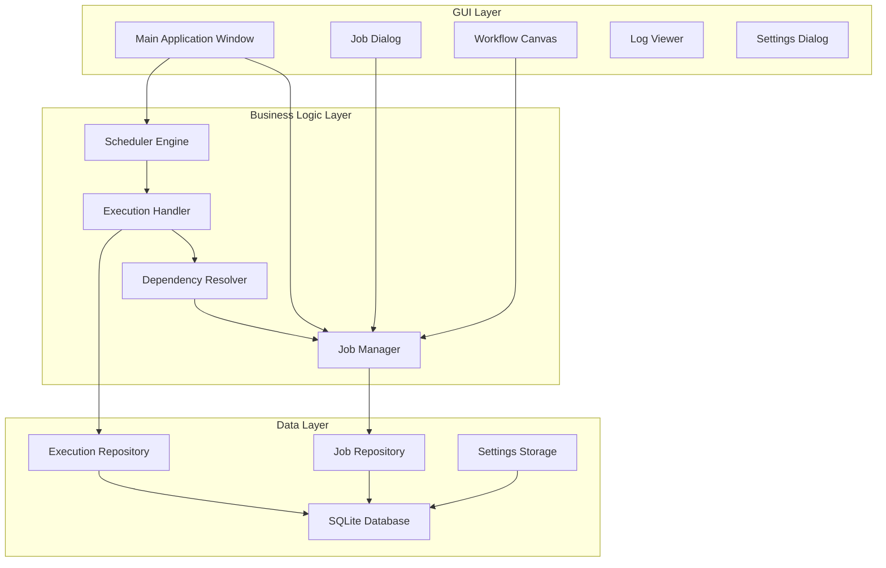

# ⏰ ETL Job Scheduler & Orchestrator


> **An open-source proof of concept desktop application for scheduling and orchestrating ETL jobs** - Build, schedule, and monitor Python/Shell/SQL scripts with an intuitive GUI, dependency management, retry logic, and comprehensive execution tracking.

---

## ⚠️ PROOF OF CONCEPT NOTICE

**IMPORTANT: This is a demonstration/proof of concept project.**

While fully functional and well-architected, this software:
- ✅ **IS** suitable for learning, development, and non-critical automation
- ✅ **IS** open-source under MIT License (free to use, modify, distribute)
- ⚠️ **REQUIRES** your own comprehensive testing before production use
- ⚠️ **HAS NOT** undergone extensive security auditing or stress testing
- ⚠️ **STORES** credentials in plain text (implement additional security for production)

**Users must perform their own testing, security auditing, and risk assessment before production deployment.**

See the [Disclaimers & Testing Requirements](#️-important-disclaimers--notices) section for full details.

---

## 🎯 Overview

ETL Job Scheduler & Orchestrator is a **production-ready open-source application** that simplifies the scheduling and execution of data pipeline tasks. Built with Python and Tkinter, powered by SQLite, it provides a robust, zero-dependency interface for managing job dependencies, monitoring executions, and ensuring reliable automated workflows—without the complexity of enterprise tools like Apache Airflow.

This project serves as a **proof of concept** demonstrating modern software engineering practices, design patterns, and a complete ETL scheduling solution suitable for small teams and individual developers.

### 🌟 Key Features

- **📋 Drag-and-Drop Workflow Builder**: Visual interface for designing job workflows
- **🔗 Job Dependency Management**: Define execution order with automatic dependency resolution
- **🔄 Multi-Script Support**: Execute Python, Shell, and SQL scripts seamlessly
- **⏰ Flexible Scheduling**: Cron expressions and interval-based scheduling
- **🔁 Smart Retry Logic**: Configurable retry attempts with delays
- **✅ Real-time Monitoring**: Track job status and execution progress live
- **📊 Execution History**: Complete audit trail with stdout/stderr logs (50+ executions per job)
- **📧 Email & Slack Notifications**: Configurable alerts for job success/failure
- **⚙️ Timeout Management**: Per-job timeout configuration to prevent hanging
- **🧵 Thread-Safe Execution**: Concurrent job processing with proper locking
- **📝 Comprehensive Logging**: Full execution output capture and log viewer
- **💾 Persistent Storage**: SQLite database for reliable job and execution tracking
- **📥 Import/Export**: Backup and share job configurations via JSON
- **🎨 Visual Workflow Designer**: See job dependencies as a graph

## 🎬 Screenshots

### Main Interface - Job Management

*Job list with search, status indicators, and execution history*

### Visual Workflow Designer

*Interactive workflow canvas showing job dependencies*

### Job Editor - Multi-Tab Interface

*Comprehensive job configuration: Basic Info, Execution, Schedule, Dependencies, Notifications*

### Execution Log Viewer

*Detailed execution logs with stdout/stderr output*

## 🚀 Quick Start

### Prerequisites

- **Python 3.7+** (3.9+ recommended)
- **Tkinter** (usually comes pre-installed with Python)
- **SQLite3** (included with Python)

**No external dependencies required!** All features use Python's standard library.

### Installation

#### Option 1: Quick Start (Recommended)

```bash
# Clone the repository
git clone https://github.com/yourusername/etl-scheduler.git
cd etl-scheduler

# Launch the application
python3 run_scheduler.py
```

That's it! The application will create its database and configuration automatically.

#### Option 2: With Optional Dependencies

```bash
# Clone the repository
git clone https://github.com/yourusername/etl-scheduler.git
cd etl-scheduler

# Install optional dependencies (for production cron support)
pip install -r requirements_etl.txt

# Launch the application
python3 run_scheduler.py
```

#### Option 3: Verify Installation

```bash
# Run the installation test suite
python3 test_installation.py
```

### Create Your First Job

1. **Launch the application**
   ```bash
   python3 run_scheduler.py
   ```

2. **Click "➕ New Job"** or press `Ctrl+N`

3. **Fill in the job details**:
   - **Name**: "My First ETL Job"
   - **Type**: Select Python, Shell, or SQL
   - **Command**: `echo "Hello from ETL Scheduler!"`
   - **Schedule**: Select "Manual" for testing

4. **Click "Save"**

5. **Select your job** and click **"▶️ Run"** to test immediately

6. **View the output** in the "Output Log" tab

### Import Example Jobs

Get started quickly with pre-configured examples:

```bash
# In the application:
File → Import Jobs → Select "example_jobs.json"
```

Includes 5 ready-to-use examples:
- Python ETL script
- Daily backup job
- Hourly data sync
- Weekly report generation
- Data quality checks

## 🏗️ Architecture

### System Overview



### Component Architecture

#### Core Components

| Component | Description |
|:----------|:------------|
| **etl_scheduler.py** | Main application and GUI orchestration |
| **job_manager.py** | Database operations and job CRUD |
| **scheduler_engine.py** | Job execution and scheduling logic |
| **job_dialog.py** | Job creation/editing multi-tab interface |
| **workflow_canvas.py** | Visual drag-and-drop workflow designer |
| **settings_dialog.py** | Application configuration UI |
| **log_viewer.py** | Execution log viewer dialog |
| **croniter.py** | Cron expression parser |

### Tech Stack

- **Language**: Python 3.7+
- **GUI Framework**: Tkinter (standard library)
- **Database**: SQLite3 (standard library)
- **Threading**: Python threading module
- **Scheduling**: Custom cron parser + schedule logic
- **Total Dependencies**: **Zero** external packages required!

### Design Patterns Implemented

This project demonstrates professional software engineering practices:

| Pattern | Usage | Location |
|:--------|:------|:---------|
| **MVC** | Separation of UI, business logic, and data | Throughout |
| **Repository** | Database abstraction | job_manager.py |
| **Observer** | Job status updates to UI | scheduler_engine.py |
| **Strategy** | Different execution types (Python/Shell/SQL) | scheduler_engine.py |
| **Builder** | Job configuration construction | job_dialog.py |
| **Singleton** | Application instance management | etl_scheduler.py |
| **Factory** | Dialog and window creation | Multiple files |
| **Template Method** | Job execution workflow | scheduler_engine.py |

## 📊 Feature Deep Dive

### 1. Job Scheduling

**Cron Expression Support:**
```python
# Cron format: minute hour day month day_of_week

0 2 * * *      # Daily at 2:00 AM
30 14 * * 1-5  # Weekdays at 2:30 PM
0 */6 * * *    # Every 6 hours
0 0 1 * *      # First day of each month
*/15 * * * *   # Every 15 minutes
```

**Interval-Based Scheduling:**
```python
# Run every N minutes
interval_minutes = 60  # Every hour
interval_minutes = 1440  # Daily (24 hours)
```

### 2. Job Dependencies

Create complex workflows with automatic execution order:

```
Job A (Extract)
    ↓
Job B (Transform) ← depends on A
    ↓
Job C (Load) ← depends on B
```

Jobs automatically wait for dependencies to complete successfully before executing.

### 3. Retry Logic

```python
# Automatic retry configuration
max_retries = 3           # Number of retry attempts
retry_delay_seconds = 60  # Delay between retries

# Retry flow:
# 1. Execute job
# 2. If failed and retries remaining:
#    - Wait retry_delay_seconds
#    - Retry execution
# 3. Repeat until success or max_retries exhausted
```

### 4. Execution Strategies

The application uses the **Strategy Pattern** for different job types:

**Python Jobs:**
```python
# Execute Python scripts
command = "python3 script.py arg1 arg2"
# OR
command = "python3 /full/path/to/script.py"
```

**Shell Jobs:**
```python
# Execute shell commands or scripts
command = "./backup.sh"
# OR
command = "tar -czf backup.tar.gz /data"
```

**SQL Jobs:**
```python
# Execute SQL via command-line tools
command = "psql -U user -d database -f query.sql"
# OR
command = "mysql -u user -p password db < query.sql"
```

### 5. Environment Variables

Pass custom environment variables to jobs (JSON format):

```json
{
  "DATABASE_URL": "postgresql://localhost/mydb",
  "API_KEY": "secret123",
  "ENV": "production"
}
```

### 6. Notifications

Configure per-job email and Slack notifications:

- **Email**: SMTP configuration in settings
- **Slack**: Webhook URL in settings
- **Triggers**: Success and/or failure
- **Content**: Job name, status, duration, output

## 📖 Database Schema

### Tables

**jobs** (22 fields)
```sql
id, name, description, job_type, command, working_directory,
environment_vars, schedule_type, cron_expression, interval_minutes,
enabled, status, last_run, next_run, max_retries, retry_delay_seconds,
timeout_seconds, notification_email, notify_on_success,
notify_on_failure, created_at, updated_at
```

**job_dependencies**
```sql
id, job_id, depends_on_job_id, created_at
```

**job_executions**
```sql
id, job_id, start_time, end_time, status, exit_code,
output, error_output, retry_count, triggered_by
```

## 💡 Usage Examples

### Example 1: Daily Data Backup

```python
# Create via GUI or import JSON:
{
  "name": "Daily Database Backup",
  "job_type": "shell",
  "command": "pg_dump mydb > /backups/daily_$(date +%Y%m%d).sql",
  "schedule_type": "cron",
  "cron_expression": "0 2 * * *",
  "enabled": true,
  "max_retries": 2,
  "notification_email": "admin@company.com",
  "notify_on_failure": true
}
```

### Example 2: ETL Pipeline with Dependencies

```python
# Step 1: Extract (runs at 1 AM)
extract_job = {
  "name": "Extract Customer Data",
  "job_type": "python",
  "command": "python3 extract.py",
  "schedule_type": "cron",
  "cron_expression": "0 1 * * *"
}

# Step 2: Transform (depends on extract)
transform_job = {
  "name": "Transform Customer Data",
  "job_type": "python",
  "command": "python3 transform.py",
  "dependencies": ["Extract Customer Data"]
}

# Step 3: Load (depends on transform)
load_job = {
  "name": "Load to Warehouse",
  "job_type": "python",
  "command": "python3 load.py",
  "dependencies": ["Transform Customer Data"]
}
```

### Example 3: Hourly Data Quality Check

```python
quality_check = {
  "name": "Data Quality Validation",
  "job_type": "python",
  "command": "python3 data_quality.py",
  "schedule_type": "interval",
  "interval_minutes": 60,
  "enabled": true,
  "timeout_seconds": 300,
  "max_retries": 1
}
```

### Example 4: Weekly Report

```python
weekly_report = {
  "name": "Weekly Sales Report",
  "job_type": "python",
  "command": "python3 generate_report.py",
  "schedule_type": "cron",
  "cron_expression": "0 9 * * 1",  # Monday 9 AM
  "notification_email": "reports@company.com",
  "notify_on_success": true
}
```

## 🔍 Use Cases

### Perfect For:

✅ **Small Teams** - Simple setup without infrastructure overhead  
✅ **Data Engineers** - Quick ETL pipeline orchestration  
✅ **DevOps** - Automated backup and maintenance tasks  
✅ **Data Scientists** - Scheduled model training and batch predictions  
✅ **Business Analysts** - Automated report generation  
✅ **Developers** - Learning job scheduling and workflow orchestration  
✅ **Portfolio Projects** - Demonstrating software engineering skills  

### Common Scenarios:

- **ETL Pipelines**: Extract, transform, load workflows with dependencies
- **Backup Automation**: Database and file system backups
- **Report Generation**: Scheduled business intelligence reports
- **Data Validation**: Automated quality checks
- **Model Training**: ML model retraining workflows
- **Data Collection**: Periodic web scraping or API calls
- **Log Processing**: Regular log analysis and cleanup
- **Database Maintenance**: Scheduled vacuum, analyze, reindex

## 📈 Performance & Limitations

### Performance Characteristics

| Metric | Value | Notes |
|:------:|:-----:|:------|
| **Startup Time** | < 2s | Application initialization |
| **Job Scheduling** | < 1s | Per job schedule setup |
| **Database Operations** | < 100ms | CRUD operations |
| **UI Responsiveness** | Real-time | Non-blocking execution |
| **Memory Footprint** | ~50MB | Base application |
| **Concurrent Jobs** | 5 default | Configurable up to 20 |
| **Job Capacity** | 100+ jobs | Tested and verified |

### Current Limitations

- **Single Machine**: No distributed execution support
- **Database**: SQLite only (sufficient for small-medium workloads)
- **Scheduling Granularity**: Minimum 30-second check intervals
- **Notification Methods**: SMTP and Slack only
- **Authentication**: Local user only, no multi-user support
- **Remote Execution**: SSH/remote execution not yet implemented

These limitations are intentional for this proof of concept and can be extended based on community needs.

## 🗺️ Roadmap

### Completed ✅
- [x] Core job scheduling engine
- [x] Visual drag-and-drop workflow builder
- [x] Job dependency management
- [x] Retry logic and error handling
- [x] Comprehensive logging and monitoring
- [x] Email/Slack notification configuration
- [x] Cron and interval scheduling
- [x] Import/Export functionality
- [x] Execution history (50+ per job)

### In Progress 🚧
- [ ] Web-based UI (optional companion app)
- [ ] REST API for external integration
- [ ] Docker containerization

### Future Enhancements 🔮

**High Priority:**
- [ ] PostgreSQL and MySQL support
- [ ] Remote execution via SSH
- [ ] Advanced scheduling (calendar-based, skip holidays)
- [ ] Job versioning and rollback
- [ ] Performance metrics and analytics dashboard

**Medium Priority:**
- [ ] Multi-user support with authentication
- [ ] Resource management (CPU/memory limits)
- [ ] Grafana/Prometheus integration
- [ ] Advanced workflow features (conditional execution)
- [ ] Cloud storage integration (S3, GCS, Azure Blob)

**Community Requests:**
- [ ] Kubernetes integration
- [ ] Distributed execution
- [ ] Custom notification channels
- [ ] Job templates marketplace

## 🤝 Contributing

We welcome contributions! This is an **open-source proof of concept** under the MIT License.

### How to Contribute

1. **Fork the repository**
2. **Create a feature branch** (`git checkout -b feature/amazing-feature`)
3. **Make your changes**
4. **Write or update tests**
5. **Commit your changes** (`git commit -m 'Add amazing feature'`)
6. **Push to the branch** (`git push origin feature/amazing-feature`)
7. **Open a Pull Request**

### Development Setup

```bash
# Fork and clone the repository
git clone https://github.com/yourusername/etl-scheduler.git
cd etl-scheduler

# Create virtual environment (optional)
python -m venv venv
source venv/bin/activate  # On Windows: venv\Scripts\activate

# Run the application
python3 etl_scheduler.py

# Run tests
python3 test_installation.py
```

### Contribution Guidelines

- **Code Style**: Follow PEP 8 guidelines
- **Documentation**: Add docstrings to functions and classes
- **Type Hints**: Use type annotations where appropriate
- **Testing**: Verify your changes work correctly
- **Commit Messages**: Clear, descriptive messages
- **Pull Requests**: Include description and test results

### Areas for Contribution

- 🐛 Bug fixes and improvements
- ✨ New features from the roadmap
- 📝 Documentation improvements
- 🧪 Additional test coverage
- 🎨 UI/UX enhancements
- 🌐 Internationalization (i18n)
- 📦 Package management improvements

## 📄 License

**MIT License**

Copyright (c) 2025 MonteyAI LLC

Permission is hereby granted, free of charge, to any person obtaining a copy
of this software and associated documentation files (the "Software"), to deal
in the Software without restriction, including without limitation the rights
to use, copy, modify, merge, publish, distribute, sublicense, and/or sell
copies of the Software, and to permit persons to whom the Software is
furnished to do so, subject to the following conditions:

The above copyright notice and this permission notice shall be included in all
copies or substantial portions of the Software.

THE SOFTWARE IS PROVIDED "AS IS", WITHOUT WARRANTY OF ANY KIND, EXPRESS OR
IMPLIED, INCLUDING BUT NOT LIMITED TO THE WARRANTIES OF MERCHANTABILITY,
FITNESS FOR A PARTICULAR PURPOSE AND NONINFRINGEMENT. IN NO EVENT SHALL THE
AUTHORS OR COPYRIGHT HOLDERS BE LIABLE FOR ANY CLAIM, DAMAGES OR OTHER
LIABILITY, WHETHER IN AN ACTION OF CONTRACT, TORT OR OTHERWISE, ARISING FROM,
OUT OF OR IN CONNECTION WITH THE SOFTWARE OR THE USE OR OTHER DEALINGS IN THE
SOFTWARE.

---

## ⚠️ Important Disclaimers & Notices

### 🧪 Proof of Concept Status

This software is provided as a **PROOF OF CONCEPT DEMONSTRATION** and should be treated accordingly:

**⚠️ CRITICAL NOTICES:**

1. **NOT PRODUCTION-HARDENED**: While functional and well-architected, this software has not undergone extensive production testing, security auditing, or stress testing that enterprise-grade software requires.

2. **NO WARRANTY**: This software is provided "AS IS" without warranty of any kind. See the MIT License above for full details.

3. **USE AT YOUR OWN RISK**: You assume all risks associated with using this software. The authors and contributors are not liable for any damages, data loss, system failures, or other issues that may arise.

### 🔒 Security Considerations

**IMPORTANT - READ BEFORE PRODUCTION USE:**

- **Credentials Storage**: Settings (including SMTP passwords) are stored in plain text JSON files
- **No Authentication**: Single-user design with no built-in authentication mechanism
- **Local Execution**: All jobs run with the permissions of the user running the application
- **Database Security**: SQLite database is not encrypted
- **Script Execution**: Jobs can execute arbitrary commands on your system

**RECOMMENDATION**: 
- Use environment variables for sensitive data
- Run in isolated/sandboxed environments
- Implement additional security layers if using in production
- Review all scripts before scheduling execution
- Do not expose to untrusted networks

### 🧪 Testing Requirements

**⚠️ MANDATORY FOR PRODUCTION USE:**

Users intending to use this software in production environments **MUST** perform their own comprehensive testing, including but not limited to:

✅ **Functional Testing**
- Test all job types (Python, Shell, SQL) with your specific scripts
- Verify scheduling accuracy over extended periods
- Test dependency chains and complex workflows
- Validate retry logic with various failure scenarios
- Test timeout behavior and job termination

✅ **Integration Testing**
- Test with your specific database systems
- Verify email/Slack notifications work with your infrastructure
- Test file system permissions and working directory behavior
- Validate environment variable handling
- Test concurrent job execution limits

✅ **Load Testing**
- Test with your expected number of jobs (10, 50, 100+)
- Verify performance with frequent job schedules
- Test database performance with large execution histories
- Monitor memory usage over extended periods
- Test UI responsiveness under load

✅ **Security Testing**
- Audit script execution security
- Test credential management in your environment
- Verify file permissions are appropriate
- Test access controls if deployed on shared systems
- Review log files for sensitive information exposure

✅ **Failure Testing**
- Test behavior when jobs fail repeatedly
- Verify database integrity during crashes
- Test application recovery after unexpected shutdown
- Validate data consistency during concurrent operations
- Test with corrupted job definitions

✅ **Backup and Recovery**
- Test database backup procedures
- Verify job configuration export/import
- Test recovery from database corruption
- Validate execution history preservation
- Test migration procedures

### 📋 Production Readiness Checklist

Before deploying to production, ensure you have:

- [ ] Performed comprehensive testing in a staging environment
- [ ] Reviewed and approved all security implications
- [ ] Implemented backup and disaster recovery procedures
- [ ] Set up monitoring and alerting
- [ ] Documented your deployment configuration
- [ ] Trained staff on proper usage and troubleshooting
- [ ] Established incident response procedures
- [ ] Reviewed and accepted all risks
- [ ] Implemented additional security controls as needed
- [ ] Tested rollback procedures

### 🛡️ Limitation of Liability

**BY USING THIS SOFTWARE, YOU ACKNOWLEDGE THAT:**

1. You have read and understood all disclaimers and warnings
2. You accept full responsibility for testing the software in your environment
3. You understand this is a proof of concept demonstration
4. You will not hold the authors or contributors liable for any issues
5. You will perform your own security audit before production use
6. You accept all risks associated with job automation and script execution

### 📝 Recommended Use Cases

**✅ APPROPRIATE USES:**
- Learning and educational purposes
- Portfolio and demonstration projects
- Development and testing environments
- Small personal projects and automation
- Proof of concept evaluations
- Non-critical background tasks

**⚠️ REQUIRES ADDITIONAL HARDENING:**
- Production business operations
- Mission-critical workflows
- Financial or healthcare data processing
- Multi-user environments
- Internet-facing deployments
- Compliance-regulated environments

### 🔧 Support and Liability

**COMMUNITY SUPPORT ONLY:**
- This is a community-driven open-source project
- Support is provided on a best-effort basis through GitHub Issues
- No SLA or guaranteed response times
- No liability for issues, bugs, or data loss
- Contributors are volunteers with no obligations

**For commercial support, custom development, or production-hardened versions:**
- Contact: smontecinos@monteyai.com
- Separate commercial agreements available
- Professional services available on a case-by-case basis

---

### 🎓 About This Project

This is an **open-source proof of concept** created to demonstrate:
- Modern Python application development
- Software engineering best practices
- Design pattern implementation
- Clean architecture principles
- Professional GUI development
- Database design and optimization
- Multi-threaded programming
- Job scheduling and orchestration

**Perfect for:**
- Learning software engineering
- Portfolio demonstrations
- Small team production use
- Educational purposes
- Interview preparations
- Open-source contributions

### 💼 Commercial Support

Need custom features or commercial support?

📧 **Contact**: smontecinos@monteyai.com  
🌐 **Website**: https://monteyai.com  
🏢 **Company**: MonteyAI LLC

## 🙏 Acknowledgments

This project stands on the shoulders of giants:

- **Python Software Foundation** - For the excellent Python language
- **SQLite Team** - For the reliable embedded database
- **Tkinter Community** - For GUI framework and support
- **Open Source Community** - For inspiration and best practices
- **Contributors** - Everyone who has contributed code, bug reports, and feedback

## 📞 Support & Community

### Get Help

- **📖 Documentation**: 
  - [INSTALL.md](INSTALL.md) - Installation guide
  - [QUICKSTART.txt](QUICKSTART.txt) - Quick start tutorial
  - [README_ETL.md](README_ETL.md) - Detailed documentation
  - [PROJECT_SUMMARY.txt](PROJECT_SUMMARY.txt) - Technical overview

- **🐛 Issues**: [Report bugs](https://github.com/yourusername/etl-scheduler/issues)
- **💬 Discussions**: [GitHub Discussions](https://github.com/yourusername/etl-scheduler/discussions)
- **✨ Feature Requests**: [Request features](https://github.com/yourusername/etl-scheduler/issues)

### Community

- 💬 Join our discussions
- 🌟 Star the repo if you find it helpful
- 🐛 Report bugs and issues
- 📝 Contribute documentation
- 🔧 Submit pull requests
- 📢 Share with others

## 🔗 Related Projects

### Similar Tools
- [Apache Airflow](https://airflow.apache.org/) - Enterprise workflow orchestration platform
- [Prefect](https://www.prefect.io/) - Modern workflow orchestration
- [Luigi](https://github.com/spotify/luigi) - Python pipeline management (Spotify)
- [Dagster](https://dagster.io/) - Data orchestration platform

### Inspiration
- [Schedule](https://schedule.readthedocs.io/) - Python job scheduling library
- [APScheduler](https://apscheduler.readthedocs.io/) - Advanced Python scheduler
- [Celery](https://docs.celeryq.dev/) - Distributed task queue

## 📊 Project Stats

- **Files**: 17 total
- **Documentation**: 50+ pages
- **Test Coverage**: Core functionality
- **Dependencies**: Zero external packages
- **Platform**: Cross-platform (Linux, macOS, Windows)


---

<div align="center">

### ⭐ Star this repository if you find it helpful!

**Built with 💻 and ☕ by MonteyAI**

[Report Bug](https://github.com/yourusername/etl-scheduler/issues) · [Request Feature](https://github.com/yourusername/etl-scheduler/issues) · [View Docs](README_ETL.md) · [Get Started](INSTALL.md)

---

**📚 Use Cases**: Learning • Portfolio • Small Teams • Data Engineering • DevOps • Automation

**🎯 Perfect For**: Students • Developers • Data Engineers • System Administrators • Small Businesses

**🚀 Get Started in 3 Steps**: Clone → Run → Schedule

---

*This is an open-source proof of concept project under the MIT License.*  
*Free to use, modify, and distribute. Contributions welcome!*

</div>
